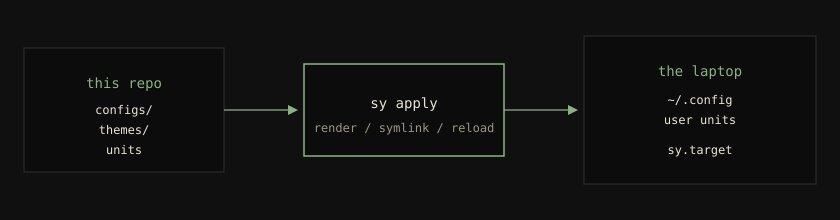
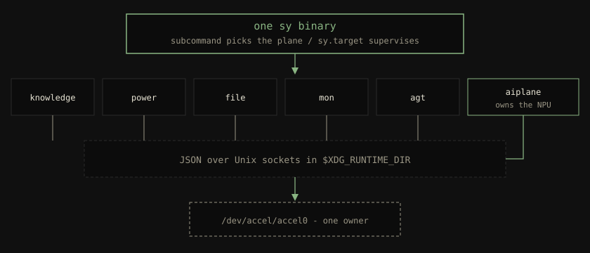

<!-- Template source: Good Docs Project explanation template (CC-BY 4.0) — https://www.thegooddocsproject.dev/template/explanation. Diátaxis quadrant: explanation. -->

# What sy is

This page is the product story. It does not install anything. If you
already know you want `sy` and need commands, go to
[the bring-up tutorial](../tutorials/getting-started.md). If you want
the engineering “why this shape”, go to
[how the planes fit together](architecture.md).

## Why this exists

A coding laptop in 2026 is not just a desktop. You search your own
files, you let an agent run tools, you care which silicon burns
power, and you still want a compositor, a bar, and a file manager
that do not fight each other.

The usual way to get that is a pile of projects: a compositor from
here, a search daemon from there, MCP snippets pasted into four
agent configs, a GPU left running because embeddings were easiest
on CUDA, a Spark box you ssh into with a notebook. Each piece
works. None of them share a CLI, a supervisor, or a git history.
Six months later you cannot rebuild the laptop.

`sy` is one answer to that: an **Agentic OS layer for Fedora 43**.
One Rust binary plus the `configs/` tree in this repo. You clone,
you build, you run `sy apply`, you enable `sy.target`. The desktop,
the search index, the file manager, and the agent plumbing come from
that apply. An agent talks to the same
`sy` commands you do.

The name is short on purpose. `sy` is the orchestrator, not a
Linux distribution. Fedora stays Fedora. `sy` sits on top and
refuses to leave state that only exists on this one disk.

## A day with it

Morning: you log into niri. The bar, terminal colours, and
keybindings are whatever the repo last applied. Super+E opens the
file manager on `$HOME`. Hover a README; the preview is a PNG from
a tiny plugin, not a headless browser.

You registered `~/Documents/notes` yesterday. `sy knowledge search
"re-exec dance"` returns the paragraph you wrote, with a chunk id
you can fetch in full. In Cursor you ask the same question; the
agent calls `knowledge_search` because `sy auto` already wrote the
MCP server into the client config.

You `sudo true`. If the phone is in your pocket and paired, syauth
wins the PAM stack with a biometric tap. If the phone is in the
other room, FIDO or your password still works. syauth is
`sufficient`, never a lockout.

Super+M opens a health popup with CPU, NPU holders, knowledge queue,
and agent denials.

If a DGX Spark is on the desk, `sy spark dgx-spark serve …` is how
you start a signed engine. The laptop never holds Docker. Chat
clients talk to `https://<spark>:9843/openai/<instance>/v1` after
health checks pass.

None of that required you to remember which unit file belongs to
which git checkout. `sy.target` is the user systemd target. `sy
doctor` is the health pass.

## What you get

Required hardware: a Fedora 43 x86_64 laptop and a network. That is
the whole list for bring-up.

| You can… | How it shows up |
|----------|-----------------|
| Rebuild the machine from git | `sy apply` renders `configs/` and starts `sy.target` |
| Search folders you own | `sy knowledge` (CLI, MCP, waybar tile) |
| Browse files in a window | `sy file`, Super+E |
| Let an agent use the same tools | `sy auto` writes MCP configs; `sy knowledge mcp`, `sy file mcp`, `sy mon mcp` |
| Glance at plane health | `sy mon` / Super+M, or `sy doctor` |
| Theme the session from the repo | `sy apply --theme …` then reload niri |

Optional, only if you have the device:

| You can… | Needs |
|----------|--------|
| Run embeddings on the NPU, leave the GPU for LLMs | AMD Ryzen AI (`/dev/accel/accel0`) |
| Serve a local-ish model with OpenAI- and Anthropic-shaped URLs | a DGX Spark on the LAN |
| Approve `sudo` with the phone | Android 13+, BLE |

Skip any optional row. The install does not fail because you lack
an NPU.

## How it is put together

One binary. Systemd starts it as different *planes* (long-running
roles): knowledge daemon, power daemon, file daemon, and so on.
Planes do not call each other in-process. They send JSON over Unix
sockets in `$XDG_RUNTIME_DIR`. That socket is also what you can
debug with `socat` and what an MCP server proxies.

`sy apply` is how the repo becomes the laptop. Templates under
`configs/` are rendered with a theme from `themes/`. Units under
`configs/systemd/user/` are linked into the user manager. A change
that is not in the repo is a *snowflake*; snowflakes are banned
because they are the thing you cannot reproduce.

Agents are first-class. Commands that print a document take
`--json`. Commands that change the machine take `--dry-run` (or
they default to dry-run and want `--apply`). Exit codes are
stable. There is no wizard that an agent cannot complete.

The longer mechanical story — NPU single-owner, Spark’s
unprivileged agent vs root executor, sandbox policy — is
[how the planes fit together](architecture.md).

## Why it is strict

Reproducibility and agents pull in the same direction: one CLI,
one config tree, one supervisor. The cost is that a one-line
tweak in `~/.config/waybar/style.css` is the wrong move. You edit
`themes/` or `configs/`, you apply, you get the colour on every
machine that applies that commit.

The other cost is Fedora-shaped. `sy` is not trying to be the
agent layer for macOS or for “any systemd”. It is trying to be
complete on one OS version.

## Alternatives we considered

- **Dotfiles plus a wiki of shell snippets.** Easy the first
  week. The wiki drifts; the laptop does not. Rejected.
- **A separate “syctl” API for agents.** Two surfaces drift.
  Rejected: one `--help`.
- **Let every tool open the NPU.** The device wedges. Rejected:
  one owner.

## See also

- [Start here](../intro.md)
- [Why there are no snowflakes](no-snowflakes.md)
- [Why the CLI is agent-first](agent-first-cli.md)
- [How the planes fit together](architecture.md)
- [Tutorial: bring up sy](../tutorials/getting-started.md)
