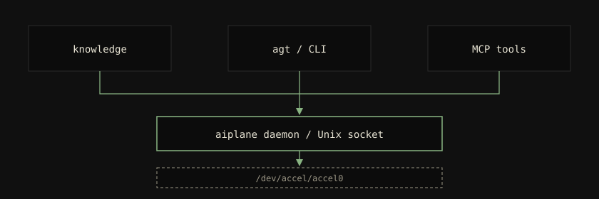

<!-- Template source: Good Docs Project explanation template (CC-BY 4.0) — https://www.thegooddocsproject.dev/template/explanation. Diátaxis quadrant: explanation. -->

# Why embeddings run on the NPU, not the GPU

## Why this exists

`sy knowledge` turns local files into vectors. That work has to
run somewhere: CPU, discrete GPU, or the AMD XDNA NPU on a Ryzen
AI laptop. The project sends it to the NPU on purpose, even though
an early version used CUDA via `fastembed`.

The short reason: the GPU is for the models you actually want to
chat with. The NPU is otherwise idle. Embeddings are a good fit
for that idle silicon.

## How it works

The `aiplane` daemon is the only process that opens
`/dev/accel/accel0`. Workloads declare an execution-provider
preference of `Vitisai` or `Cpu`. CUDA is not in the chain. The
session pool loads VitisAI when `/opt/AMD/ryzenai/venv` exists,
otherwise CPU.

That is also why the embed model is `multilingual-e5-base`
(768-dim), not `-large`. VitisAI EP 1.7.1 caps internal ModelProto
serialisation at 2 GiB. `e5-large` overshoots that cap even after
quantisation. The MTEB quality cost is roughly six points on the
average score, which the project accepted to keep the GPU free
and the NPU in the loop.

A one-shot `sy knowledge search` from the CLI still goes through
the daemon. Starting a second ORT session "just for this query"
would race the device and pull CUDA context plus about a gigabyte
of VRAM for a single string. The daemon is already warm under
`sy.target`.

## Trade-offs

- **NPU quality versus GPU convenience.** `-base` is a weaker
  embedder than `-large` on CUDA. The win is zero VRAM and a free
  dGPU.
- **Vendor-specific runtime.** The AMD venv pin is more
  reproducible than a pip-resolved CUDA wheel, and it does not
  run on NVIDIA-only boxes. Those boxes use CPU (or they are not
  the target).
- **Single owner.** Nothing else on the machine may open the
  accelerator while `aiplane` holds it. Stability beat sharing.

## Alternatives we considered

- **CUDA as primary**, the original fastembed path. Rejected: a
  search should not spin up a GPU driver context.
- **VitisAI, then CUDA, then CPU.** Rejected: CUDA is the wrong
  vendor for this laptop, and a three-way chain hides the case
  where the NPU setup failed.
- **CPU only.** Always available, too slow for bulk indexing.

The decision record with drivers and options is
[ADR 0003](../adr/0003-vitisai-ep-not-cuda-for-on-device-embedding.md).

## See also

- [How to set up the NPU](../how-to/set-up-npu.md)
- [How the planes fit together](architecture.md)
- [Glossary: VitisAI EP](../reference/glossary.md#vitisai-ep)
