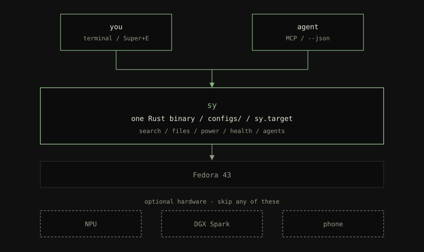
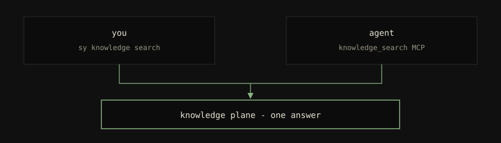

<!-- Start-here: product story first, then the Diátaxis map.
     The long-form story is docs/explanation/what-sy-is.md. -->

# Start here

`sy` turns a stock **Fedora 43** laptop into a workstation you and
an AI agent can drive the same way.

It is one Rust program and the `configs/` tree in this git repo.
You build the binary, run `sy apply`, and enable `sy.target`. The
compositor session, semantic search, file manager, power governor,
and agent plumbing then match the repo. If the disk dies, a fresh
Fedora install plus those steps is the same machine. That promise
is the product.

You do **not** need an AMD NPU, a DGX Spark, or an Android phone.
Those are extras. Bring-up is a plain laptop and a network.

The longer story — a day using it, what is optional, why the rules
are strict — is [What sy is](./explanation/what-sy-is.md).

## What you can do

On every install:

- **Reproduce the desktop from git.** Colours, keybindings, units,
  and the bar come from `sy apply`, not from a folder of one-off
  edits. See [why there are no snowflakes](./explanation/no-snowflakes.md).
- **Search your own files.** Register a folder, index it, search
  from the CLI or from Claude / Cursor / Codex / Gemini. Tutorial:
  [search your local files](./tutorials/search-your-files.md).
- **Browse files in a window.** Super+E opens `sy file`. Markdown
  preview does not spawn Chrome. Tutorial:
  [browse files with sy file](./tutorials/browse-your-files.md).
- **Hand the same tools to an agent.** `sy auto` writes MCP server
  entries. The agent calls `knowledge_search` the way you call
  `sy knowledge search`. Tutorial:
  [drive sy from an agent](./tutorials/drive-sy-from-an-agent.md).
- **Ask why the laptop picked a power profile**, open a health
  popup (Super+M), run `sy doctor`.

If you have the hardware:

- **Ryzen AI NPU** — embeddings stay on the NPU so the GPU stays
  free for models you chat with.
  [Set up the NPU](./how-to/set-up-npu.md).
- **DGX Spark** — signed model serving on the LAN, OpenAI- and
  Anthropic-shaped URLs, Docker stays on the Spark and off the
  laptop. [Install the Spark agent](./how-to/install-spark.md).
- **Android phone** — tap to approve `sudo` over Bluetooth; if the
  phone is away, password or FIDO still works.
  [Unlock sudo with your phone](./tutorials/syauth-setup.md).

A *plane* is one long-running role of that same binary (search,
power, file manager, …). You do not install a separate package per
plane.

[How the planes fit together](./explanation/architecture.md)
is the mechanical picture.

## Learn by doing

Follow these in order on a new laptop.

1. [Bring up sy on a fresh Fedora 43 laptop](./tutorials/getting-started.md)
2. [Search your local files](./tutorials/search-your-files.md)
3. [Browse files with sy file](./tutorials/browse-your-files.md)
4. [Drive sy from an agent](./tutorials/drive-sy-from-an-agent.md)
5. [Unlock sudo with your phone](./tutorials/syauth-setup.md) — skip
   without an Android phone.

## Look up a job or a flag

How-to (you already know the job):

- [Set up the NPU](./how-to/set-up-npu.md)
- [Add a knowledge source](./how-to/add-a-knowledge-source.md)
- [Wire MCP into your agents](./how-to/wire-mcp-into-agents.md)
- [Apply a theme](./how-to/apply-a-theme.md)
- [Run sy doctor](./how-to/run-doctor.md)
- [Read power status](./how-to/read-power-status.md)
- [Install the Spark agent](./how-to/install-spark.md)
- [Serve a model on Spark](./how-to/serve-a-model-on-spark.md)
- [Run sy file from a shell](./how-to/run-sy-file.md)
- [Troubleshoot sy file](./how-to/troubleshoot-sy-file.md)
- [Write a sy plugin](./how-to/write-a-sy-plugin.md)
- [Troubleshoot a sy plugin](./how-to/troubleshoot-sy-plugin.md)
- [Troubleshoot syauth](./how-to/troubleshoot-syauth.md)

Reference (flags, schemas, words):

- [CLI](./reference/cli.md)
- [Configuration](./reference/config.md)
- [Spark](./reference/spark.md)
- [Glossary](./reference/glossary.md)
- [syauth PAM module](./reference/syauth-pam-module.md)
- [sy file doctor](./reference/sy-file-doctor.md)
- [sy file MCP](./reference/sy-file-mcp.md)

Why (design, not steps):

- [What sy is](./explanation/what-sy-is.md)
- [How the planes fit together](./explanation/architecture.md)
- [Why there are no snowflakes](./explanation/no-snowflakes.md)
- [Why the CLI is agent-first](./explanation/agent-first-cli.md)
- [Why embeddings run on the NPU, not the GPU](./explanation/why-npu-not-gpu.md)
